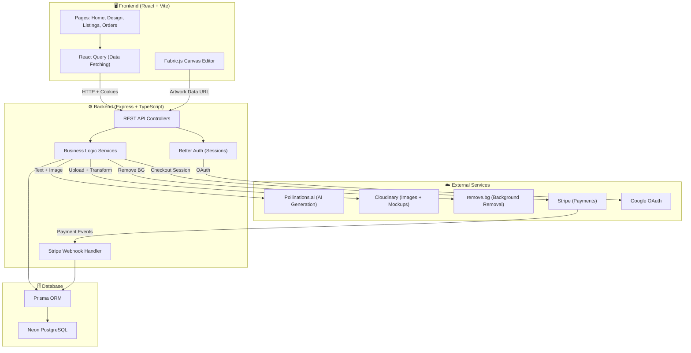
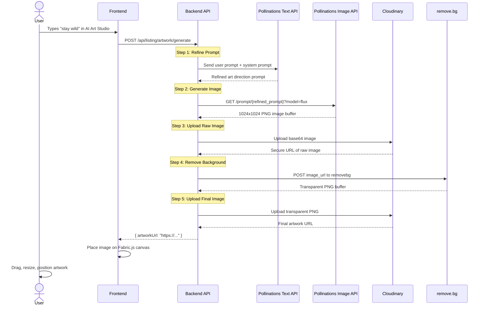
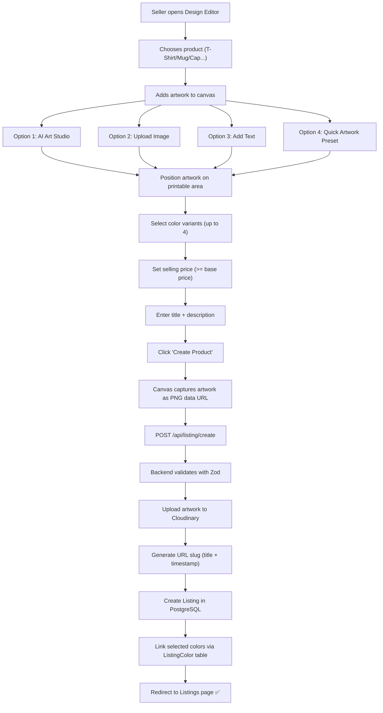
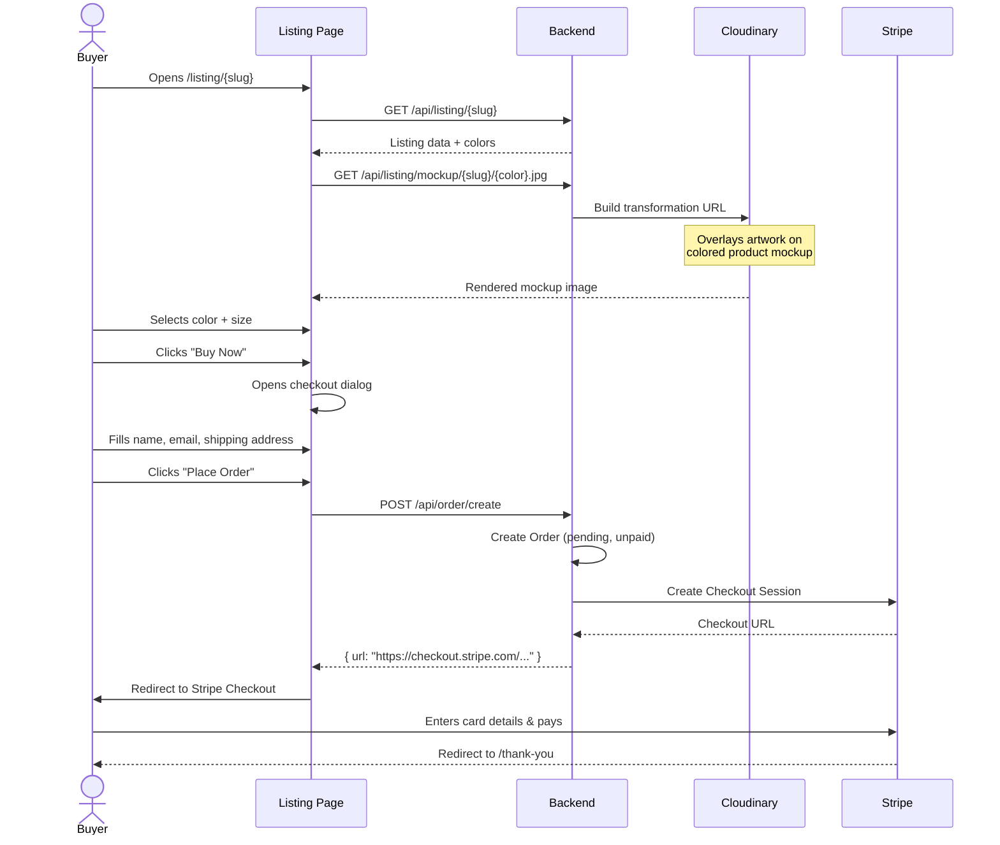
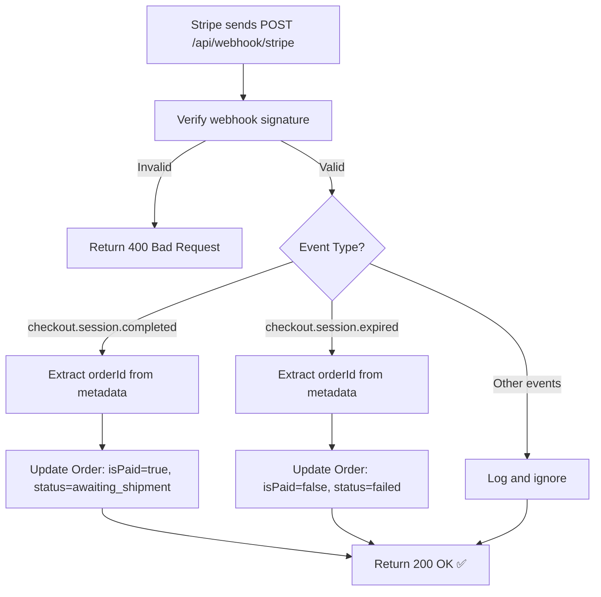
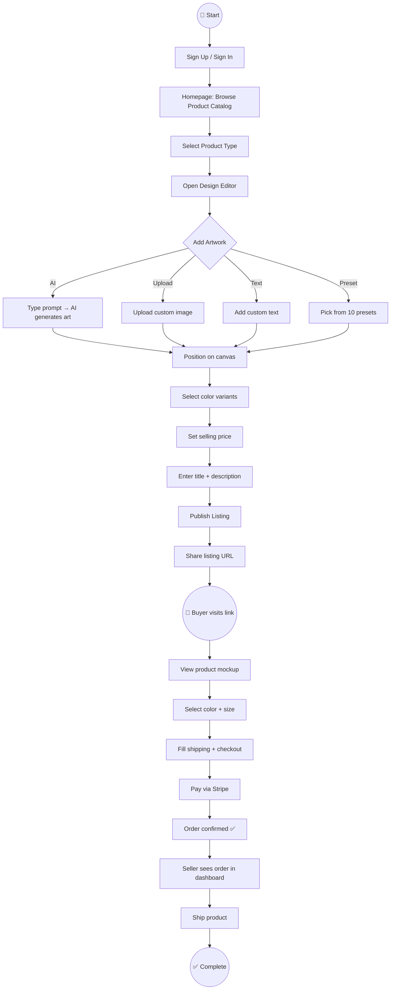

# BrandForge AI — Workflow Diagrams

## 1. System Architecture Overview

---

## 2. AI Artwork Generation Pipeline

---

## 3. Listing Creation Flow

---

## 4. Buyer Purchase & Checkout Flow

---

## 5. Stripe Payment Webhook Flow

---

## 6. Dynamic Mockup Generation (Cloudinary)

```mermaid
flowchart LR
    A["Request: /mockup/cool-tiger/black.jpg"] --> B["Find listing by slug"]
    B --> C["Find color by name"]
    C --> D["Get printable area coordinates"]
    
    D --> E["Build Cloudinary URL"]
    
    subgraph CloudinaryTransform["Cloudinary Transformation Pipeline"]
        F["1. Fetch base mockup image (colored product)"]
        G["2. Overlay artwork (public_id)"]
        H["3. Resize artwork to printable area (width × height)"]
        I["4. Position at (x, y) from top-left"]
        J["5. Output as JPG quality 90"]
    end
    
    E --> F --> G --> H --> I --> J
    J --> K["Return rendered mockup URL"]
```

---

## 7. Complete User Journey (End-to-End)

